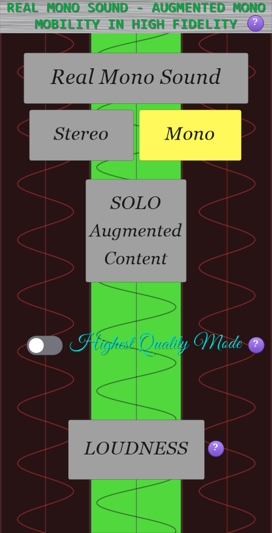
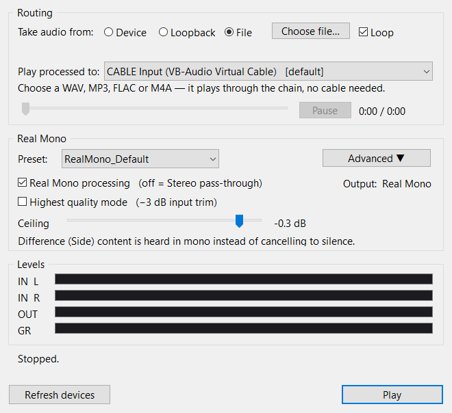
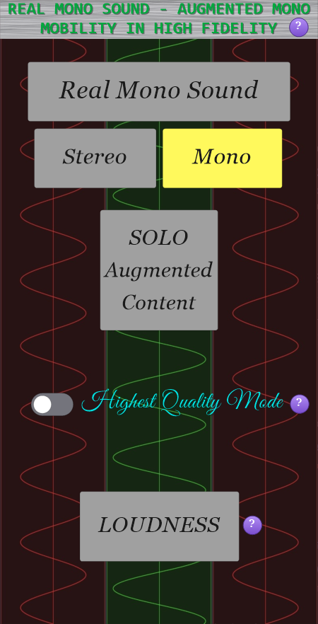
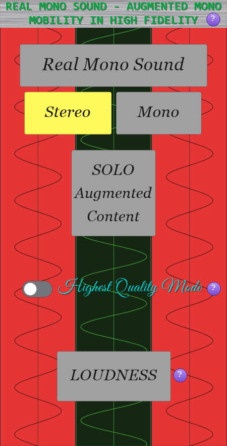

# Real Mono Sound — stereo to a mono feed that keeps the difference

A standalone Windows app that takes audio on its way out of another
application — a browser tab, a streaming service, a media player — converts it
to a **true mono-compatible** signal, and plays only that to your speakers. The
original stereo never reaches an output device.



The point is what happens to the difference between the two channels. A plain
`(L+R)/2` downmix cancels it: anything panned wide, anything in anti-phase, the
reverb tail that was only ever in the Side, all of it goes silent the moment
the two channels meet. Real Mono rotates the Side by 90° before the sum, so it
survives instead.

| Content | Plain `(L+R)/2` | Real Mono |
| --- | --- | --- |
| Correlated / centre | present | present |
| Hard panned | −6 dB | −3 dB, in quadrature |
| Pure difference (`R = −L`) | **silent** | recovered at full level |

Those three rows are asserted in `tests/TestRealMono.cpp`, not claimed here.

## The chain

```
  stereo in
    │
    ├─ Stage 0   HQ input trim         −3 dB, off by default
    ├─ Stage 1   Side high-pass        BYPASSED — the client's process has none
    ├─ Stage 2   M/S split             M = (L+R)/2      S = (L−R)/2
    │                                        │               │
    ├─ Stage 3   +90° rotation      delay-aligned      rot₊₉₀(S)
    ├─ Stage 4   mono commit           mono = M + rot₊₉₀(S)
    ├─ Stage 5   look-ahead limiter    ceiling −0.3 dBFS
    └─ dual mono out                   outL = outR
```

Which is, in one line:

```
mono = 0.5 · [ (L + R) + rot₊₉₀(L − R) ]
```

### Where the ±90° went

The reference process describes a Side-only *stereo bus* with +90° on its left
and −90° on its right — MSED into PHA-979, twice. That bus is `(S, −S)`, and a
−90° rotation is the negative of a +90° one, so after rotation it is
`(rot₊₉₀(S), rot₊₉₀(S))`: both channels identical. Its mono downmix is exactly
`rot₊₉₀(S)`, so the two-rotator arrangement collapses to one rotation of S.
Same signal, half the work.

### Levels, and the overshoot

M and S use the 0.5 convention, so correlated content comes out at unity and
pure difference content also comes out at unity. What overshoots is programme
material: `rot₊₉₀(S)` has the same magnitude spectrum as S but a different
waveform, so its peaks land in different places and the sum can exceed
`max(|L|,|R|)`. On the test suite's programme-like material that overshoot
measures **+2.26 dB**, which is the ~3 dB the client reported. Stage 5 catches
it; highest quality mode takes 3 dB at the input instead, so the sum has the
headroom before it needs winning back.

## Interception

Windows has no supported way for a normal application to reach into another
app's audio and change it in place. There are three ways to get near it, and
this app takes the third:

| Approach | Why not / why yes |
| --- | --- |
| Kernel virtual audio driver (like VB-CABLE itself) | Needs an EV code-signing certificate and WHQL attestation to load on a normal machine. Cannot be shipped from a source checkout. |
| System-effect APO injected into the endpoint | Still a driver-package INF install and still signed, and support varies by audio driver. This is the brief's preferred path and remains open — the DSP does not care which side feeds it. |
| **Route through a virtual cable and process in user mode** | **No driver, no signing, works today. Costs one free third-party install and one Windows setting.** |

```
  Browser / streaming service / player
            │
            ▼
  ┌───────────────────────┐
  │  CABLE Input          │   ← set this as the Windows default playback device
  │  (VB-Audio VB-CABLE)  │
  └───────────┬───────────┘
              │  the audio is now inside the cable,
              │  and is NOT going to any speaker
              ▼
  ┌───────────────────────┐
  │  CABLE Output         │   ← captured here (WASAPI, event-driven)
  └───────────┬───────────┘
              ▼
     ring buffer + drift-corrected resampler
              ▼
       the Real Mono chain above
              ▼
  ┌───────────────────────┐
  │  Your speakers        │   ← rendered here, dual mono
  └───────────┬───────────┘
              ▼
             🔊  one coherent feed, every room
```

The unprocessed audio never reaches a speaker because the only device it was
ever sent to is the cable, and the cable has no speaker on it.

## Setup

1. **Install VB-CABLE** — the free VB-Audio Virtual Cable driver, from
   <https://vb-audio.com/Cable/>. Reboot when it asks.
2. **Make it the default output.** Settings → System → Sound → Output →
   *CABLE Input (VB-Audio Virtual Cable)*. Everything now goes silent, which is
   correct: the audio is in the cable and nothing is playing it yet.
3. **Open Real Mono Sound.** It preselects *CABLE Output* as the source as soon
   as it sees one, and your default device as the destination. Set *Play
   processed to* to your real speakers or headphones.
4. **Press Start.**

To send only *one* app through the chain rather than everything, leave the
system default alone and use Settings → System → Sound → Volume mixer → *App
volume and device preferences*, setting just that app's output to *CABLE
Input*.

### Trying it without installing anything

**Take audio from** offers three sources, and only the first needs the cable:

| Source | What it does |
| --- | --- |
| **Device** | Captures a real endpoint — the cable, as set up above. This is the product. |
| **Loopback** | Taps a *playback* device instead. Good for auditioning, but not interception: you hear the original alongside the mono version, because the original is still going to a real speaker. |
| **File** | Plays a file straight through the chain. No cable, no second endpoint, nothing else running. |

Pointing loopback at the same device you render to is refused rather than
warned about: it is a feedback loop that reaches full scale in well under a
second.

### Playing a file through it



Pick **File**, press *Choose file…*, press *Play*. The file goes through the
same ring, resampler and `RealMonoChain` a live capture does — it is a source,
not a separate code path — so what you hear is what the app would have played
had the audio arrived down a cable. It plays to whatever *Play processed to* is
set to.

The transport is a seek bar, a Pause button and a clock, on the line the banner
lends it in file mode:

| Control | What it does |
| --- | --- |
| **Seek bar** | Scrub anywhere in the file, playing or stopped. Stopped, it chooses where *Play* will begin. The jump is heard one ring buffer later — about 30 ms — because what is already queued belongs to the render thread and is not the producer's to throw away. |
| **Pause** | Holds the position and feeds silence, so the chain stays alive and the endpoint stays fed. Distinct from *Stop*, which tears the audio threads down and rewinds to the start. |
| **Loop** | On by default, and live. |

| Format | How |
| --- | --- |
| **WAV** | This project's own RIFF reader, the one `realmono-wav` uses. 8/16/24/32-bit PCM and 32-bit float. |
| **MP3, FLAC, M4A/AAC, WMA** | Windows' own codecs, via Media Foundation. |
| **Ogg Vorbis** | Only if *Web Media Extensions* is installed — see below. |

Leave it looping and toggle *Real Mono processing* while it plays: that is the
A/B the whole app exists for. Turn looping off mid-pass and the file is allowed
to end, at which point the app stops itself and rewinds.

Two things worth knowing. The file is decoded into memory in one go, so there
is a **ten-minute ceiling** — longer files load their first ten minutes and say
so, and the whole file is `realmono-wav`'s job anyway. And because a file has
no crystal to drift against, the drift controller is switched off for it: the
resample ratio is exactly rate-in over rate-out, so a 44.1 kHz file into a
48 kHz card plays at 0.918750 and stays there. Nothing invents pitch error on
the one source you can compare against a reference note for note.

Ogg Vorbis is the one format Windows does not always have. If it is missing the
app says so and names the fix: install **Web Media Extensions** from the
Microsoft Store (it ships with Windows 10 1809 and later, but is absent on some
installs), or convert the file. Everything else works out of the box.

## The interface

Two windows, and only one of them is the product.

### The face

<p align="center">
  
  
  
</p>

The client's screen, and the whole of what a listener touches. Five things to
press:

| Control | What it does | Where it lands |
| --- | --- | --- |
| **Real Mono Sound** | Nothing. It is the heading, and it is grey in every one of the client's screens. | — |
| **Stereo** | Hear the original, untouched. | global bypass off |
| **Mono** | Hear the Real Mono feed. | global bypass on |
| **SOLO Augmented Content** | Lift the recovered difference content *inside* the mix, so what a plain downmix throws away is what you notice. | Side inject, +6 dB |
| **Highest Quality Mode** | The −3 dB input trim, so the sum keeps its dynamics instead of being handed back by the limiter. | Stage 0 |
| **LOUDNESS** | Drive the output 6 dB harder into the limiter: peaks stay where they were, everything under them comes up. | output gain, +6 dB |

Stereo and Mono are one setting drawn as two buttons, so exactly one of them is
yellow at all times. That pair is the A/B the whole product exists for.

**The background is driven by the engine, not by the buttons.** It is the idle
plate until audio is actually moving; then the band doing the work lights up —
the red sides for a stereo pass-through, the green centre for the mono feed.
Which is the client's own visual argument for what the product does, so it goes
dark again the moment the audio stops rather than agreeing with a button that
is merely selected.

The three **?** buttons open the explanation for what they sit next to. The one
on the banner also says where the routing went.

Nothing on the face keeps its own state: every control is read back out of the
panel below, and pressing one moves the panel's control. Two windows each
holding their own idea of whether the limiter is on is two windows that will
one day disagree, and the one the client is looking at will be the wrong one.

### The Routing & Advanced panel


Where the devices are chosen, where **Start** is, and where every setting
actually lives. It opens beside the face at launch, because nothing can play
until someone has been in here. Closing it puts it away rather than shutting
the app down; **Ctrl+A** on the face brings it back, as does *Routing &
Advanced…* on the face's system menu (Alt+Space).

Four controls on its front page, because that is what the demo has: a preset,
the global enable, highest quality mode, and the limiter ceiling.

The routing row above them is one line because the three sources are mutually
exclusive: the row underneath it changes meaning with the choice — an endpoint
list, or the file being played — and the banner explains whichever one is
showing, so neither needs a row of its own.

Everything else is behind **Advanced**, where every one of the five stages has
its own visible bypass — no stage is a code-only flag.


| Preset | What it is |
| --- | --- |
| `RealMono_Default` | Stages 2–5 on, Stage 1 off, HQ off, ceiling −0.3 dBFS |
| `RealMono_HighestQuality` | The same, plus the −3 dB input trim |
| `Lab_SafeMidOnly` | Rotation off, commit set to Mid only — classic mono, the reference to A/B against |
| `Lab_WithMonoLF` | Default plus Stage 1 at 120 Hz |

Bypassing a stage passes audio through in the domain the graph expects:
Stage 2 off leaves the plain sum (with no Side there is nothing to rotate),
Stage 4 off leaves the rotated result in stereo as `M ± rot₊₉₀(S)`, and the
global bypass is untouched stereo.

Switching any of that mid-programme fades the output through zero for a few
milliseconds first, holds it down while Stage 5's look-ahead buffer flushes the
audio it committed under the old settings, and fades back in. Without the hold,
a switch clicks exactly one look-ahead later — which is what the fade was
supposed to prevent and did not, until it was measured.

## Stage reference

### Stage 0 — highest quality mode
−3 dB at the input, so the Mid + rotated Side sum keeps its dynamics instead of
being handed back by the limiter. Exactly 3 dB, asserted. Off by default; the
output is 3 dB quieter, which is the point.

### Stage 1 — Side high-pass (lab, bypassed)
The client's process has no high-pass, so this ships off. It is kept because
the brief wants it available for LF double-counting experiments, and the
interface bypasses it rather than the code omitting it.

6 / 12 / 24 dB per octave, 40–400 Hz, in two shapes. On a mono output "make the
bass mono" and "high-pass the Side" are the same statement, so the shape
control is what actually differs: Butterworth (−3 dB at fc) or Linkwitz-Riley
(−6 dB at fc, the half of a crossover whose complement is the Mid-only band).

### Stage 2 — M/S split
`M = (L+R)/2`, `S = (L−R)/2`, with a gain on each. Bypassed, there is no Side,
and the chain degrades to the classic downmix.

### Stage 3 — the rotation
Three qualities, and the trade is latency against phase linearity:

| Mode | Delay at 48 kHz | Flat from | Phase |
| --- | --- | --- | --- |
| Linear phase, HQ (1023 taps) | 511 samples, 10.65 ms | ~120 Hz | linear |
| Linear phase, short (255 taps) | 127 samples, 2.65 ms | ~300 Hz | linear |
| Allpass IIR | 1 sample | 20 Hz | non-linear, shared by both paths |

The linear-phase modes are a windowed type-III FIR Hilbert transformer — the
PHA-979 behaviour, every frequency shifted by the same 90° — and the Mid path
is delayed to match, sample-exactly.

The allpass mode is a pair of four-section allpass chains whose outputs stay 90°
apart. Neither branch is linear phase, but *both carry the same phase*, so the
90° between Mid and Side is exact while the latency is one sample. Measured
worst error across 20 Hz–20 kHz: **0.69°**. It is not the default because
transients smear where the FIR's do not.

Measured phase error for the FIR modes across their flat band: **0.00°**.

### Stage 4 — mono commit
`Mid + rotated Side` is the product. `Sum` (the raw reference downmix, ignoring
the Mid gain) and `Mid only` are there to A/B against. `Side energy fold` and
`Polarity matrix` are lab modes and are not the client's process.

### Stage 5 — look-ahead limiter
Exact sliding-maximum peak detection over the look-ahead window, so the gain is
already down before the peak it is reducing arrives; one-pole attack at a fifth
of the window, 100 ms release, and a final clamp so "brickwall" is true rather
than nearly true. Ceiling −3…0 dBFS, look-ahead 5–10 ms. Latency is exactly the
look-ahead.

## Latency

The chain reports its own delay, and the app adds it to the round trip on
screen rather than leaving it out of the number:

| Part | At the shipping defaults, 48 kHz |
| --- | --- |
| Device period, capture / render | 10.0 / 10.0 ms |
| Ring buffer (`targetBufferMs`) | 30.0 ms |
| **Stage 3 rotation** | **10.65 ms** (511 samples) |
| **Stage 5 look-ahead** | **5.00 ms** |
| Render endpoint buffer | 22.0 ms |
| **Round trip** | **~67.6 ms** |

If that is too much for video, the Advanced page's quality control is where the
15.65 ms of chain latency goes: short FIR takes it to 7.65 ms, allpass to
5.02 ms. Add a virtual cable in front and its own period joins the total.

### Clock drift

The capture and render endpoints are different devices with different crystals.
Even when both say 48 kHz they are not the same 48 kHz, and a hundred parts per
million of drift will empty or overflow the ring within minutes. The
resampler's ratio is therefore trimmed by a slow proportional controller on the
ring's fill level — hard-smoothed to about 1 Hz so it corrects the trend rather
than packet jitter, and clamped to ±0.5% (about 8 cents) so a misbehaving
controller degrades to slightly-wrong-speed rather than to a chirp.

The same mechanism handles a genuine rate mismatch, so a 44.1 kHz cable into a
48 kHz card needs no special case.

## The DSP, and RS-MET

The brief asks for RS-MET (`rapt` / `rosic`) for the Hilbert transformer, the
FIR designer and the limiter. No RS-MET checkout is present in this workspace,
so `src/RealMono.h` is the noted fallback: published, small-footprint designs
written to the same interfaces, so substituting the real thing is a change
inside `RealMonoChain` and nowhere else.

| Here | RS-MET equivalent |
| --- | --- |
| `HilbertFir` | `rapt` FIR designer + convolver |
| `QuadratureNetwork` | `RAPT::QuadratureNetwork` |
| `Biquad` / `HighpassChain` | `rosic` cookbook biquads, Linkwitz-Riley |
| `LookaheadLimiter` | `rosic::Limiter` |

If RS-MET is adopted, note the licence question early: it is dual-licensed, and
a commercial Windows product may need a commercial arrangement rather than the
GPL side. Credit to Robin Schmidt either way.

Convolution with a client-supplied IR (Stage 3's `convolution_ir` in the brief)
is **not** implemented: no IR was supplied, and a mode that cannot be exercised
is worse than an absent one. The FIR path is where it would go.

## Building

Needs Visual Studio 2022 (or Build Tools) with the C++ workload, the Windows
SDK, and CMake 3.20+. Built and tested with MSVC 19.44 / Windows SDK 10.0.26100.

Still no third-party dependency. The DSP is all in `src/RealMono.h`; the file
player's compressed formats go through Windows' own Media Foundation codecs
rather than a vendored decoder; and the face is drawn with GDI+, which decodes
the client's JPEGs, takes their fonts from memory without installing them, and
antialiases the curves. All three are Windows system libraries, not vendored
code.

The artwork in `resources/` is compiled into the executable (`src/Resources.rc`),
so the exe is the whole deliverable — there is no folder beside it to lose.

```sh
cmake -S . -B build -G "Visual Studio 17 2022" -A x64
cmake --build build --config Release
```

Produces `build/Release/fmd-router.exe` and `build/Release/fmd-router-tests.exe`.
Compiles clean at `/W4 /permissive-` with no warnings.

### Tests

```sh
build/Release/fmd-router-tests.exe        # exit code 0 = all passed
```

71 checks over the chain, the ring and the resampler, none of which touch a
Windows API. The ones worth knowing about:

- Anti-phase input is recovered at its original level, and the app's own
  classic-mono mode cancels the same input to −240 dB.
- The rotation is measured, not derived: Side leads Mid by 90° across each
  mode's band, and all three modes rotate the same way. A sign error here would
  still sound like Real Mono on most material.
- The Mid path is exactly the reported delay — deviation `1.5e-08` — so the two
  paths cannot silently drift apart.
- The limiter holds its ceiling on a 4× transient, and the reported latency
  matches the parts it is made of at 48 and 44.1 kHz.
- Global bypass is bit-exact stereo, and the normal output is dual mono sample
  for sample.
- A NaN from the capture device never reaches the endpoint, and the chain
  recovers once it has flushed through.

## Hearing it without a cable: `realmono-wav`

Judging the chain by ear through the live path needs a virtual cable and two
endpoints. `realmono-wav` does not: it runs a WAV file through the *same*
`RealMonoChain` the audio thread runs, so what it writes is what the app would
have played. This is the harness for the A/B against the client's before/after
references.

```sh
build/Release/realmono-wav --demo source.wav                      # a test signal
build/Release/realmono-wav source.wav realmono.wav                # the product
build/Release/realmono-wav source.wav classic.wav --preset midonly  # to A/B against
```

The output is latency-compensated by default, so the files line up sample for
sample and can be dropped onto adjacent DAW tracks without nudging anything.
Every stage bypass, quality mode and gain from the Advanced page has a flag;
`--help` lists them.

`--demo` writes twelve seconds in four sections, which is the fastest way to
hear what the product does. Measured on those sections, dB RMS:

| Section | Source | Real Mono | Classic mono |
| --- | --- | --- | --- |
| Correlated | −12.50 | −12.50 | −12.50 |
| **Pure Side** (`R = −L`) | −12.50 | **−12.50** | **−240.00** |
| Hard panned left | −13.47 | −16.48 | −19.49 |
| Widened mix | −11.65 | −11.65 | −13.47 |

The second row is the product: a plain downmix takes it to digital silence,
Real Mono returns it at its original level. The third is the −3 dB quadrature
sum against the −6 dB linear one. The fourth is the case that matters on real
programme material — a mono bass with a widened top, where the top is what goes
missing.

`realmono-wav` reads WAV only, and stays portable that way — it shares
`src/AudioFile.h` with the app, so the two agree sample for sample on the
format the validation actually uses. To run an MP3 through it, convert first:

```sh
ffmpeg -i "stereo flute and mono guitar.mp3" -c:a pcm_s24le test.wav
```

To simply *hear* an MP3 through the chain there is nothing to convert — use the
app's **File** source, which decodes it with Windows' own codecs.

## What has and has not been verified

**Verified on the build machine** (Windows 10 Pro 19045, Realtek HD Audio):

- Builds clean at `/W4`, all three targets.
- All 71 offline checks pass.
- **The face, driven end to end.** Every control was clicked and the panel read
  back afterwards: Stereo and Mono move the global bypass, the switch checks
  highest quality mode, and SOLO and LOUDNESS land on exactly +6.0 dB of Side
  inject and +6.0 dB of output. The three background plates were seen in all
  three of their states — idle while stopped, red while passing stereo through,
  green while playing the mono feed — and the switch between them follows the
  engine, not the button.
- **The two-window lifecycle.** Closing the panel hides it and leaves the app
  running; the face's system-menu item brings it back; closing the face stops
  the audio threads and exits cleanly with the engine still running at the time
  it was asked to.
- Every screenshot in this file is a render of the current build's own window
  (`PrintWindow`), not a screen grab, so none of them can drift from what the
  code draws without being obvious.
- The app starts, runs the new chain live at 48 kHz for 6 s with **zero drops**,
  keeps the drift controller inside 0.01% of unity, and reports 15.6 ms of chain
  latency as part of the round trip. The ring readout is sampled from the GUI
  thread rather than at a block boundary, so it swings by up to one render
  block either side of its 30 ms target; the drops counter is the number that
  says whether that mattered.
- Every control on both pages is bound to a parameter the audio thread reads,
  and the stage bypasses grey out the controls they disable. The enable, HQ and
  Stage 3 switches were clicked while the engine was running, and the chain
  reported the state change each time.
- End to end on a file: the `--demo` signal through `realmono-wav` gives the
  table above, dual mono on every frame, and latency compensation exact to
  0.00000.
- **The File source, live.** A 48 kHz WAV and a 44.1 kHz MP3 were both decoded
  and played through the real engine — file thread, ring, resampler, chain,
  WASAPI render — for six seconds each, with **zero underruns and zero
  overruns**. The 44.1 → 48 kHz case held its ratio at exactly 0.918750 for the
  whole run, which is the drift controller correctly staying out of the way. A
  0.41 s file with looping off ended, reported it, and stopped the engine
  cleanly.
- **The decoders present on this machine**, enumerated through `MFTEnumEx`:
  MP3, AAC, WMA and FLAC all registered. Ogg Vorbis is **not** — see below.
- **The transport, in the app and headlessly.** A 3:54 MP3 was chosen through
  the file dialog, played with live metering, paused (position frozen, input
  peak to zero, no underruns), resumed, scrubbed to 25% and 75% — landing on
  0:58 and 2:55 of 3:54 — and stopped, which rewound to 0:00 and re-enabled the
  source controls. The screenshot above is that run.

**Not verified:**

- **Audibility.** Nobody has listened to it. The numbers say the Side is
  recovered at the right level and the right phase; they say nothing about
  whether the client agrees it is their process.
- **Against the client's material.** `stereo flute and mono guitar.mp3` and the
  before/after references were not available here, so the A/B against Alex's
  MSED + PHA-979 chain has not been run. That is the first thing to do, and
  `realmono-wav` is the tool for it.
- **The VB-CABLE path end to end.** VB-CABLE *is* installed on this machine and
  the app opens *CABLE Output* and runs against it with no drops, but nothing
  has been played into the cable from another application, so the full
  browser → cable → app → speakers route is still unexercised.
- **Ogg Vorbis.** Windows has no Vorbis decoder on this machine, so that branch
  has only been seen failing — with the right message, naming *Web Media
  Extensions*, which is the fix. Every other format decodes.
- **Audio quality of the File source by ear.** It runs without dropping a
  sample; nobody has listened to it.
- **Other hardware.** One Realtek codec, one machine.

## Known limits

- **Sources with more than two channels lose their surrounds.** Only the first
  two channels are read, which are front L/R in every WAVE layout. Browsers emit
  stereo and Windows puts stereo in the front pair, so this is correct in
  practice, but a genuine 5.1 source is not downmixed properly.
- **Output goes to the front pair only**; a centre speaker or LFE is fed
  silence rather than the signal. For multi-room the front pair is what the
  zones take, but a centre channel would want the same feed.
- **Settings are not saved.** Device choice, preset, the chosen file and every
  control return to their defaults on restart. The face opens on the shipping
  preset, so highest quality mode starts off — the client's screens show the
  switch on, but `RealMono_Default` says off and the tests assert it.
- **The banner strip is generated, not supplied.** The three background plates
  and the three type faces came from the client; the grey marble the banner sits
  on did not, so `src/Skin.h` draws it — light stone with darker veins, from a
  fixed seed. If the real artwork turns up it is a file in `resources/images`,
  an id in `Resources.h`, and a one-line change.
- **The panel's file-path label does not paint**, though it holds the right text
  and reports itself visible. It predates this work — the same blank row is in
  the previous build's screenshot — and the file name is also in the banner
  underneath it, so nothing is unreachable. Not yet chased down.
- **The File source is a test player, not a media player.** Play, pause, seek,
  loop and stop; no playlist, no waveform, no output recording.
- **Files are held in memory, capped at ten minutes.** A longer one loads its
  first ten minutes and says so. `realmono-wav` has no such limit.
- **Stage 3's HQ mode rolls off below ~120 Hz** — a windowed FIR Hilbert cannot
  hold 90° all the way down without more taps, and more taps is more latency.
  Side content below that is attenuated rather than rotated. The allpass mode
  holds 90° to 20 Hz if that matters more than linear phase.
- **Capture needs microphone permission.** WASAPI capture is gated by Settings →
  Privacy → Microphone even for a virtual cable; if Start fails with access
  denied, that is why, and the error message says so.
